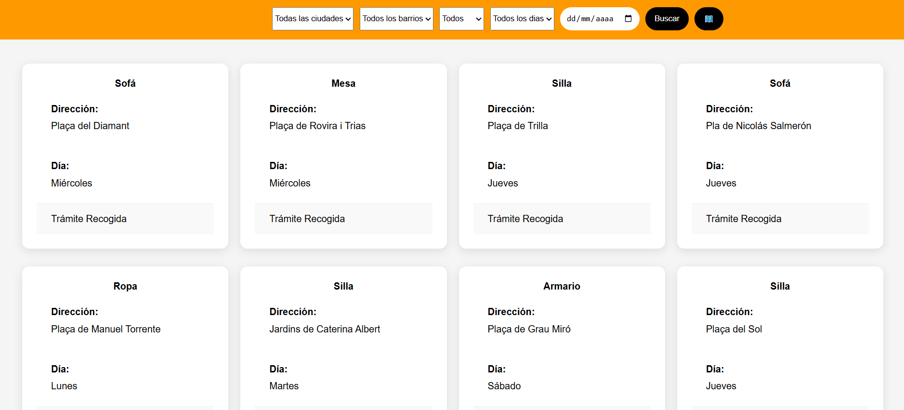
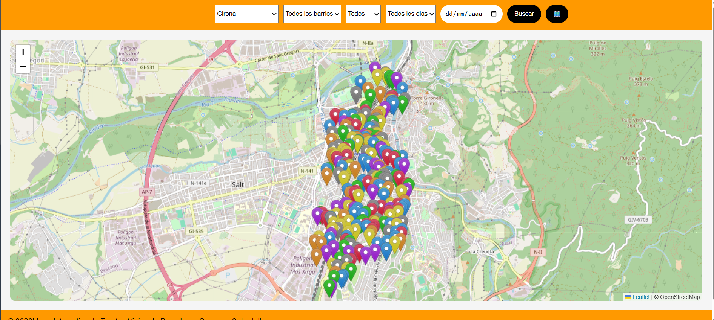

# 📒 Projecte PHP + MySQL — Mapa Interactiu Trastos

## Curs Confecció i Publicació de Pàgines Web 2026

### Arnau Pardal Termens per a CIFO Barcelona La Violeta





🎯 Descripció

Aplicació web desenvolupada en HTML5, CSS3, JavaScript, PHP i MySQL que permet visualitzar amb targetes i un mapa interactiu els carrers de Barcelona, Sabadell i Girona.

Inclou funcionalitats de visualització de dades dinàmiques per pantalla:

```text
✔ Filtrar dades per Ciutat, Barri, Dia, Objecte i Dia prefixat de calendari 
✔ Visualitzar dades de targetes de forma dinàmica per pantalla (utilitzant la filtració esmentada)
✔ Visualitzar amb un mapa interactiu les dades i localitzacions dels carrers  
 
```

🧠 Objectiu del projecte

Aquest projecte té un enfocament informatiu:

```text
aprendre a saber realitzar un mapa interactiu des de zero
```

Treballant conceptes com:

* Utilització de Api's com Leaflet amb OpenStreetMap
* Connexió a base de dades (PDO)
* consultes SQL
* arquitectura bàsica
* separació de responsabilitats

---

## 🗂️ Estructura del projecte

```text
/data            → taula.sql (per importar la BBDD)
/css, /js        → estils i scripts
```

---

## ⚙️ Instal·lació

### 1. Configurar entorn

* Instal·lar XAMPP (o semblant)
* Copiar el projecte a:

```text
htdocs/
```

---

### 2. Crear base de dades

Pots fer-ho de l'única forma:

### Opció  — Manual

Crear una base de dades anomenada:

```text
trastos
```

Crear taules necessàries important (veure arxiu `trastos.sql`)

---

## 🔄 Flux de l'aplicació

```text
Filtres → Llistar → Mapa
```

---

## 🧩 Conceptes treballats

* CRUD complet
* SQL (SELECT, INSERT, UPDATE)
* PHP + PDO, JavaScript
* pujada d'arxius
* rutes i estructura de projecte
* que el IA es un lladre de idees humanes

---

## ⚠️ Nota important

* No he inclòs els arxius de versions anteriors, de inserció de dades mitjançant tecnologia Overpass Turbo, fa que eren per aplicar-hi dades a la Base de Dades, i ara l'aplicació no es d'això

---

## 🧠 Enfocament pedagògic

Aquest projecte està pensat per a:

```text
entendre com es crea un mapa interactiu i es posa les seves dades en pantalla
```

No utilitza frameworks, però aplica els seus principis:

* Separació estructurada de les dades o fluxos segons llenguatges.
* Reutilització de codi
* Capacitació de manejar moltes dades en BBDD relacionals.
* Javascript UI, per visualitació dinamica de dades

---

# 🧭 Mapa visual del fluxe de l'aplicació

## 🔄 Flux principal

```text
index.php
    ↓
main.php (amb o sense recerca per dia de calendari)
    ↓
[ LLISTAR DADES DE OBJECTES ]
    ↓                    ↓
 Targetes               Map
    ↓                    ↓   
 └──────────────────────────┘
                     ↓
                 prue.js
```

---

## 🧠 Com he arribat fins aquí

## 🔨 Inicis

* En principi de l'aplicació tenia unes idees clares, fer una web amb un mapa interactiu, amb les dades reals al dia dels trastos de tota la ciutat, separats per dies i horaris. Segons el mestre era impossible, cosa que vaig baixar-me dels núvols, i hagué de fer una mitllor proposta.
* La segona idea mes capacitada, era ferla solament amb targetes i res de mapa interactiu, agafant les dades d'un JSON carregat cada vegada a l'entrar a la web. Sense usuaris d'accés.

## 🔨 Taules i Base de Dades

* Vaig començar buscant informació diversa, sobre la web en si, fins que vaig veure la web de Barcelona mobles. Tenien una web de busqueda d'informació amb visualització de targetes com si fossin taules. També hi havia referencies de agafar dades des d'una api vinculada al Ajuntament, la qual no vaig entendre.
* En principi vaig començar fent proves amb una taula de tipus JSON amb dades fictícies, després vaig demanar a la IA que hem dones els noms de tots els carrers del barri de Grácia i hem vare portar a una web icònica Overpass turbo, poses una consulta i et dona un GEOJSON amb les coordenades del carrers.
* El problema principal era que pel barri de gracia hem donava 5000 registres per l'array que feia tota la renderització del llistat i mapa de les dades, i no podia ser. Després va venir la bombeta, intentar fer-ho com una base de dades.
* La base de dades bàsica, incloïa les dades originals captades del GEOJSON i gravades sols una vegada a la BBDD, pero tenia problemes, es veien mases punts de coordenades al mapa, (arreglat amb centre-localització)) i s'agafaven les dades de la BD amb carrers repetits o coordenades amb errors de carga JSON, vaig canviar la estructura de la base de dades i del concepte altre cop..
* La base de dades v2, envia les coordenades desde el GEOJSON amb JS a la Base de dades, com si fos JSON, després al carregar-les les agafa amb un parse convertint les coordenades a un array. El dies de utilitzar 1 fixe i un random (cosa que el dimecres no tingues color en la marca visualitzada) va passar a 1 dia random. Una ciutat por tenir N Barris, però sols 1 barri unic per ciutat, por ser que el nom dels barris es repeteixin si son de dos ciutats diferents. Un barri te N carrers, es podrà repetir si el carrer passa per diferents barris, on cada barri es dirà amb el nom d'aquell carrer.
* Actualment la Base de dades, agafa les idees de la v2, pero no incloc al projecte la forma de inserir les dades a la Base de dades, la meva aplicació es de visualització de dades, no de introducció.
* En teoria els objectes i els dies son ficticis, random de dilluns a diumenge.

## 🔨 Arxius

* Api.php: Arxiu llançadora que ve donada l'informació des de el arxiu prue.js, per carregar-hi les dades de la BBDD i passar-les a un array temporal, on van a parar tots el resultats dels filtres.
* index.php: Index d'inicialització de la web, es dirigeix al main que executa la web principal.
* main.php: Pàgina principal, on estan definides el meu estil i el de LEAFLET, i tanmateix el contenidor dels resultats i els scripts meu i LEAFLET.
* prue.js: Aquí estan detallades les funcions de toda la lògica de la web, excepte l'API.
* estilos.css: Els pocs estils que he usat.

## 🧠 Qué esdevé a cada pas

### 🔨 Inici

* Carregar la BBDD desde el main.php al prue.js i alla a la funció asíncrona conectarDatosTrastos que agafa les dades de la api.php de la base de dades.
* Les dades a la api es fa amb una consulta `(SELECT)` recorrent les 3 taules.
* Funcionalitat futura: convertir la base de dades a un JSON, per si la base de dades no es pogués recarregar utilitzar l'arxiu JSON o no hi hagués cap backup anterior.

---

### 📋 Filtres i Llistat

* Es mostren totes les dades en pantalla en format de targetes lineals, segons el filtre seleccionat les dades es modifiquen, si els select d'opcions es a TOT i es posa una data d'un dia específic llistarà les dades d'aquell dia picant el boto buscar, si possem altres filtres sense o amb aquest filtre ens donarà l'informació filtrada.
* Si  hi ha dades es mostraran en targetes filtrades, i si cliquem el boto mapa les ubicacions de les dades filtrades
* El mapa interactiu, es veura cada dia amb el seu color, cada ubicació amb les dades de la targeta, horari de recollida i web de Barcelona amb el import del que costa de recollida en un dia no correcte.

---

## 🗂️ Com encaixa l'estructura

```text
/css
    → estils

/js
    → prue.js (Aquí es fa quasi tot)

/data
    → trastos.sql (Base de dades a importar)

Arrel
    → api.sql (conexió a la BD des de el JS)

```

---

## 🧠 Idea clau

```text
Tot es fa directament des de on vull jo
```

---
